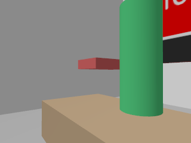
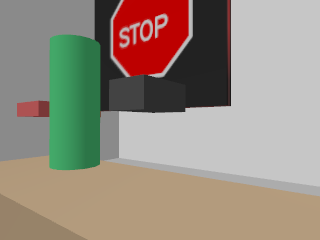
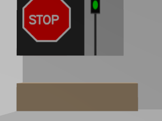
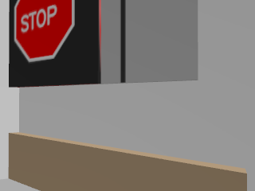
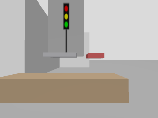
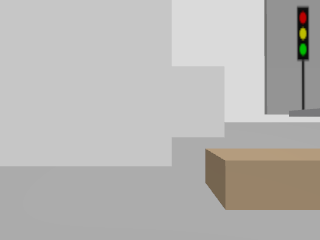
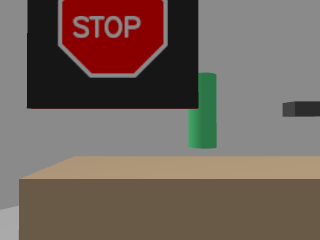
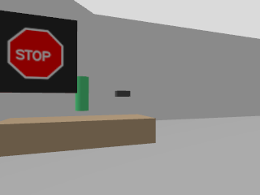

# DS685 Assignment 2 — World Assets

Bench + object placement in the maze world (Gazebo Sim).

Benches and objects are defined in `turtlebot-maze/tb_worlds/worlds/sim_house_a2.sdf.xacro`.

## Bench inventory

| bench_id | approx pose (x, y, yaw) | objects on bench |
|---|---|---|
| `bench_01` | `(-1.72, -1.24, 1.57)` | bottle, book, mouse, **stop sign** |
| `bench_02` | `(0.08, 4.36, 0.00)` | laptop, mouse, **stop sign**, **traffic light** |
| `bench_03` | `(5.98, 4.01, 1.57)` | book, laptop, **traffic light** |
| `bench_04` | `(3.93, -1.24, 0.00)` | bottle, mouse, **stop sign** |

## Robot camera screenshots (2 per bench)

PNGs are stored in `assets/world/`:

- `bench_01_view_01.png`
- `bench_01_view_02.png`
- `bench_02_view_01.png`
- `bench_02_view_02.png`
- `bench_03_view_01.png`
- `bench_03_view_02.png`
- `bench_04_view_01.png`
- `bench_04_view_02.png`

### bench_01

### bench_02

### bench_03

### bench_04

